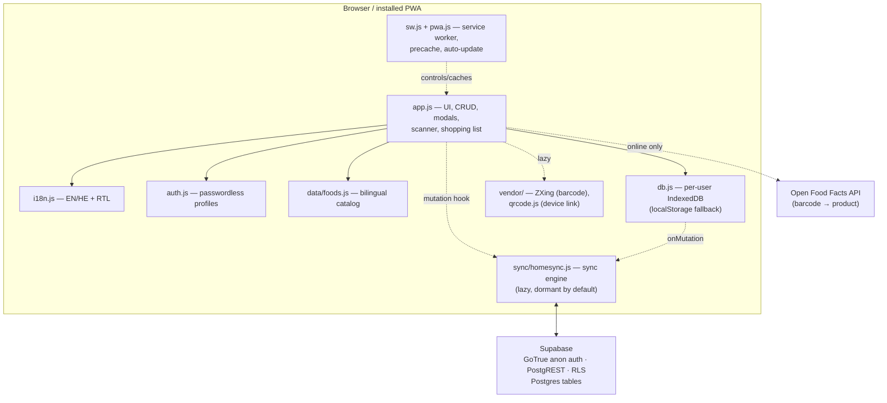

# HomeStock — How it works

A technical tour of the architecture, data model, and sync engine. Everything is
**vanilla client-side JS** (no framework/build); the optional backend is
**Supabase** (Postgres + anonymous auth + PostgREST + RLS). This document tracks
the actual code — file and function names are accurate as of **v2.0.1**.

---

## 1. High-level overview

HomeStock is **offline-first**. The UI (`app.js`) reads and writes a **per-user
IndexedDB** database through `db.js`. Everything works with **no backend**. When
cloud sync is configured *and* a device is linked, `db.js` mutations are also
captured by the lazy-loaded **sync engine** (`sync/homesync.js`), which pushes
them to Supabase and pulls remote changes back. A **service worker** (`sw.js`)
precaches the app shell for offline use and drives auto-updates.

**Startup path is deliberately lean.** `index.html` loads only
`config.js → data/foods.js → i18n.js → db.js → auth.js → app.js → pwa.js`, then
calls `window.App.start()`. The scanner (`vendor/zxing.min.js`), the QR generator
(`vendor/qrcode.js`), and the sync engine (`sync/homesync.js`) are **lazy-loaded
on demand** and precached by the service worker so they still resolve offline.

---

## 2. File / module breakdown

| File | Responsibility |
| --- | --- |
| `index.html` | App shell; script order; mounts `#root`; iOS/PWA meta. |
| `app.js` | The whole UI: rendering, inventory CRUD, modals, the barcode scanner, the shopping list, monthly tracking, and all sync glue (`SyncManager` wiring, conflict dialog, mapping to/from cloud rows). Exposes `window.App`. |
| `i18n.js` | English + Hebrew dictionaries, `t()` / `tc()` helpers, and document `lang`/`dir` (RTL) handling. Exposes `window.I18N`. |
| `db.js` | Per-user IndexedDB persistence with a localStorage fallback, store schemas, migrations, and the **mutation hook** the sync layer listens on. Exposes `window.PantryDB`. |
| `auth.js` | Passwordless profile system: `UserRepository`, `ActiveUserManager`, `UserContext`, `UserMigration`, `UserService`. Exposes `window.Auth` + `window.CurrentUser`. |
| `config.js` | Baked default Supabase URL + anon (publishable) key. Public by design. |
| `data/foods.js` | Local bilingual food catalog (names, aliases, emoji, category/unit) powering autocomplete. |
| `pwa.js` | Registers the service worker, promotes waiting workers, reloads once on `controllerchange`, surfaces `VERSION`. |
| `sw.js` | Service worker: precache `ASSETS`, cache-first fetch, offline navigation fallback, `VERSION` bump = update. |
| `manifest.webmanifest` | PWA manifest (icons + maskable, theme colors, relative paths). |
| `sync/homesync.js` | The sync engine (see §5). Node-`require()`-able for unit tests; touches no DOM at load. Exposes `window.HomeSync`. |
| `sync/schema.sql` | Supabase schema: tables, indexes, RLS policies, device-link RPCs. |
| `sync/SYNC_SETUP.md` | Step-by-step Supabase setup. |
| `vendor/zxing.min.js` | Vendored `@zxing/library` UMD (barcode decoding). |
| `vendor/qrcode.js` | Vendored QR-code generator (device-link QR). |
| `tools/auth-test.js` | Node logic harness: profiles, per-user storage, i18n parity, and a vendored-ZXing EAN-13 decode proof. |
| `tools/generate-icons.js`, `tools/generate-foods.js` | Regenerate icons / the food DB (pure Node, no deps). |

---

## 3. Data model

### 3.1 Per-user IndexedDB (`db.js`)

Each profile gets its own database **`pantry-tracker-u-<userId>`** (the base name
`pantry-tracker` is kept for backward compatibility). `PantryDB.setUser(id)`
switches the namespace after login. Current `DB_VERSION` is **4**.

| Store | Key | Contents |
| --- | --- | --- |
| `items` | `id` | Inventory records: `name`, `nameEn`, `nameHe`, `quantity`, `unit`, `categoryId`, `location`, `note`, `emoji`, `imageHash`, `desiredAmount`, `barcode`, timestamps. Indexes: `barcode`, `categoryId`, `location`. |
| `barcodes` | `barcode` | Barcode → product mapping / Open Food Facts cache. |
| `images` | `hash` | De-duplicated images `{ hash, full, thumb }` (SHA-256 content hash; dedup-on-write). |
| `shopping` | `id` | Shopping-list items (**separate model**): `name`, `nameEn/He`, `quantity`, `unit`, `categoryId`, `note`, `purchased`, timestamps. |

The **monthly log** is stored in localStorage (keyed by `YYYY-MM`), not IndexedDB.

Every write runs under an authenticated user scope (enforced in `db.js`), and
fires a **mutation notification** (`notifyMutation(table, opType, record)`) that
is a no-op until the sync layer registers a hook via `PantryDB.onMutation()`.

### 3.2 localStorage keys

Per-user keys are suffixed with `.<userId>`:

| Key | Purpose |
| --- | --- |
| `pantry.items.fallback[.uid]` | Inventory fallback (no IndexedDB). |
| `pantry.barcodes.fallback[.uid]` | Barcode-cache fallback. |
| `pantry.images.fallback[.uid]` | Image-store fallback. |
| `pantry.shopping.fallback[.uid]` | Shopping-list fallback. |
| `pantry.monthly.v1[.uid]` | Monthly restock log. |
| `pantry.lang[.uid]` | Preferred language. |
| `pantry.auth.users.v2` | Profile records (`auth.js`). |
| `pantry.migrations.v1` | Versioned migration checkpoints. |
| `pantry.imgmig.v1.<uid>`, `pantry.namemig.v1.<uid>` | One-time image / bilingual-name migrations. |
| `pantry.sync.url`, `pantry.sync.anonKey` | Optional backend override. |
| `pantry.sync.state.<uid>` | Per-profile cloud link state (incl. `cloudUserId`). |
| `pantry.sync.queue.<cloudUserId>` | Offline mutation queue. |
| `pantry.sync.lastAt` | Last successful pull timestamp. |
| `pantry.sync.migration[.shopping].<cloudUserId>` | One-time local→cloud upload checkpoints. |
| `pantry.shoppingPanel.collapsed` | Desktop shopping-panel UI state. |
| `pantry.debug` | Set to `'1'` to force the scanner debug overlay. |

### 3.3 Supabase schema (`sync/schema.sql`)

**Identity model:** each device signs in with **anonymous auth** (its own
`auth.uid()`); a **household** UUID is the shared cloud identity stored as
`user_id` on every data row. `household_members` maps `auth.uid() → household_id`.

**Tables:** `households`, `household_members`, `device_links` (identity/linking);
`users`, `products`, `inventory_items`, `shopping_lists`, `shopping_list_items`,
`monthly_plans`, `barcode_mappings`, `user_settings`, `sync_metadata` (data).
Data-row ids are the **client's own string ids**; `updated_at` drives
last-write-wins.

**RLS (deny-by-default):** every data table has a policy
`user_id in (select my_households())`, so a device can only read/write rows for a
household it belongs to. `household_members` allows self-insert (used when
redeeming a token); `device_links` and `households` are member-scoped.

**Device-link RPCs** (`SECURITY DEFINER`, `search_path = public, extensions`):
`create_household()`, `create_link_token(token, minutes)`,
`redeem_link_token(token)`, `revoke_link_tokens()`, and the `my_households()`
helper. Tokens are stored **only as a SHA-256 digest** (pgcrypto) and are
short-lived. The frontend uses **only the anon key** — RLS + anon auth are the
enforcement boundary.

---

## 4. Auth / profiles (`auth.js`)

Profiles are **not secure accounts** — they pick *who is using the app* so each
person's data stays isolated. No passwords, no hashing.

- **`UserRepository`** — CRUD for profile records in localStorage
  (`pantry.auth.users.v2`).
- **`ActiveUserManager`** — persists / restores the selected profile.
- **`UserContext`** — read-only accessor (`window.CurrentUser`).
- **`UserMigration`** — one-time, idempotent, interrupt-safe upgrade from the old
  password-based records (**strips credentials**).
- **`UserService`** (`window.Auth`) — orchestrates the above.

On entering a profile, the app calls `PantryDB.setUser(id)` to namespace storage,
and `PantryDB.migrateLegacyInto(id)` performs a one-time (checkpointed) copy of
any pre-auth single-user data into that profile. **Switch User** (fast switch) and
**Manage Users** (create/edit/delete) are distinct flows.

---

## 5. Sync engine (`sync/homesync.js`)

Stays **dormant** until there is a Supabase URL + anon key **and** a linked cloud
identity; `app.js` only lazy-loads it in that case. UI never calls the backend
directly — it goes through `SyncManager`. Modules:

- **`SyncQueue`** — offline-persisted, **coalescing** FIFO of mutation ops
  `{ table, opType:'upsert'|'delete', recordId, payload, ts, seq }`. Only the
  latest state per record is shipped; a later delete supersedes queued upserts.
  The `seq` high-water mark is restored across reloads so ordering survives.
- **`ConflictResolver`** — pure, testable merge logic: per-record
  **last-write-wins** by `updated_at`, list merge keyed by stable `id`, dedup, and
  **quantity conflict** resolution (local / remote / manual choice).
- **`Migration`** — idempotent local→cloud upload planner (first-time seeding).
- **`DeviceLink`** — crypto-random link tokens (via WebCrypto), base64url
  encoding, and link-URL/QR helpers.
- **`CloudRepository`** — thin **PostgREST + GoTrue** client: anonymous
  `signInAnonymously()`, `refreshSession()` (auto-refresh on `401`, fixing the
  stale-JWT class of errors), REST upsert/delete, and the link RPCs.
- **`SyncManager`** — event-driven orchestration (statuses:
  `disabled/idle/syncing/offline/conflict/error`):
  - **Push:** the `PantryDB.onMutation` hook enqueues ops; a **debounced**
    (~1.5 s) flush pushes them (`push-on-change`).
  - **Pull triggers:** `online`, window `focus`, and `visibilitychange`
    (visible), each scheduling a sync; plus a lightweight **periodic pull**
    (default **25 s**) while active + online (`0` disables). Pulls are gated on
    being online and the tab visible.
  - **Conflicts:** quantity clashes surface a **conflict dialog**; other fields
    resolve by last-write-wins.
  - **Mapping:** `app.js` maps local records to cloud rows and back
    (e.g. `mapShoppingToCloud` / `cloudRowToShopping`), storing the full record in
    a `data` JSONB blob alongside promoted columns.

Local table → cloud table mapping: `items → inventory_items`,
`shopping → shopping_list_items`, `barcodes → barcode_mappings`, plus
`products`, `monthly_plans`, `user_settings`, `sync_metadata`.

---

## 6. Barcode scanning (`app.js` + `vendor/zxing.min.js`)

The scanner uses the vendored `@zxing/library` `BrowserMultiFormatReader` but
drives its **own resilient frame loop** instead of the library's
`decodeContinuously` (which permanently stops on any non-decoding throw — the
cause of the old "camera works but zero detections" bug). Each tick decodes the
live video **only when the frame is ready** (`readyState ≥ 2 && videoWidth > 0`),
ignores `NotFound/Checksum/Format`, surfaces real errors to the debug overlay,
and never dies. Hints restrict to **EAN-13 / UPC-A / UPC-E / EAN-8** with
`TRY_HARDER`; the rear camera is selected via `facingMode:environment` +
`enumerateDevices` label heuristic.

- **Continuous OFF:** first code → stop camera → look up → route to result.
- **Continuous ON:** accumulate a session (with a ~2.5 s duplicate cooldown) and
  commit all at once.
- Lookups go local first (inventory → barcode cache), then **Open Food Facts**
  (online), caching results per-user.
- **Debug overlay** (`?debug=1` or `localStorage['pantry.debug']='1'`): camera
  resolution, frames/sec, decoder-running, frames-processed, last code/format, and
  last error.

---

## 7. i18n / RTL (`i18n.js`)

Full **English + Hebrew** dictionaries; `t(key, vars)` interpolates `{{var}}`,
`tc` handles counts. Switching language re-renders the app, sets
`documentElement.lang`/`dir`, and flips layout to **RTL** for Hebrew. Styling uses
**CSS logical properties** throughout so the same rules mirror correctly in RTL.
Item names are bilingual (`nameEn`/`nameHe`) with graceful fallback.

---

## 8. PWA / service worker (`pwa.js` + `sw.js`)

- **Precache:** on `install`, `sw.js` caches the lean `ASSETS` list (shell +
  lazy libs + icons) and `skipWaiting()`s; on `activate` it deletes old caches
  and `clients.claim()`s.
- **Fetch:** **cache-first**, falling back to network, with `index.html` as the
  offline navigation fallback. Open Food Facts responses are **not** cached here
  (they're persisted in the per-user `barcodes` store instead).
- **Auto-update:** `pwa.js` registers the worker, tells a waiting worker to
  `SKIP_WAITING`, and reloads **once** on `controllerchange`. It also polls
  `reg.update()` on focus/visibility. The header **version label** is fetched
  from the active worker (`GET_VERSION`).
- **Updating** = bump `VERSION` in `sw.js` (keep `FALLBACK_VERSION` in `pwa.js`
  in sync) and deploy.

---

## 9. Deploy pipeline (GitHub Pages)

The app is served statically from GitHub Pages at
<https://amordechai-dn.github.io/pantry-tracker/>. The `pantry-pwa/` directory is
the deploy repo root (remote `pantry-tracker`). Workflow:

1. Edit files; bump `VERSION` (`sw.js`) when app assets change.
2. `git commit` + `git push` to `main`.
3. GitHub Pages rebuilds (~1 min).
4. Installed PWAs pick up the new service worker on next focus/open and reload
   once.

Verification before pushing: `node --check` the changed JS, run
`node tools/auth-test.js`, and serve locally with `python3 -m http.server`.
